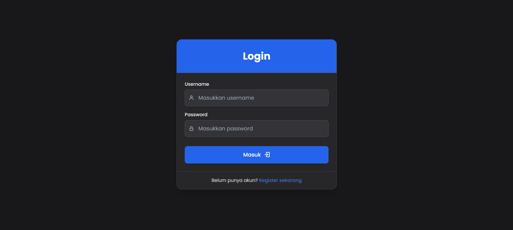

# 📦 Marketplace Product Management System  
**Developed by: M. Rabyndra Janitra Binello**  

Marketplace Product Management System is a responsive and dynamic web-based application designed to manage product inventory in an online store. It supports **user authentication, role-based authorization, and full CRUD operations** on product data, including secure image uploads. The interface includes a toggleable **light/dark mode** for a comfortable user experience.

## 🚀 Key Features  

- 🔐 **User Authentication**  
  Register and login functionality with secure session handling.

- 🛡️ **Role-Based Authorization**  
  - **Admin**: Full access to manage products (add, edit, delete).
  - **Buyer**: Can only view and search products.

- 🧾 **Product Listing**  
  Displays all available products in a responsive card layout.

- 🔍 **Search Engine**  
  Filter and search products by name for easy navigation.

- ➕ **Add Product** *(Admin only)*  
  Input product name, description, price, and image.

- ✏️ **Edit Product** *(Admin only)*  
  Update existing product details.

- 🗑️ **Delete Product** *(Admin only)*  
  Remove products from the inventory.

- 🖼️ **Upload Product Image**  
  Images are stored securely with unique hashed filenames to prevent conflicts.

- 🌗 **Light/Dark Mode**  
  Toggle between light and dark themes for user comfort.


## 🛠️ Technologies Used  
- **Frontend**: HTML, Tailwind CSS, JavaScript  
- **Backend**: PHP (Native)  
- **Template Engine**: PHP Embedded  
- **Database**: MySQL 

## ⚙️ Installation and Configuration  

1. **Clone this repository**  
   ```sh
   git clone https://github.com/ElloRabyndra/MarketPlaceManagement.git
   cd repository
   ```
2. **Database Configuration**
   - Create a new database named `marketplace`.
   - Import the `marketplace.sql` file into MySQL.
3. **Edit Database Configuration**
   - Modify the `config.php` file according to your database credentials: 
   ```php
   $host = 'localhost';
   $user = 'root';
   $password = '';
   $database = 'marketplace';
   ```
4. **Run Local Server**
   - Use XAMPP or Laragon to start `Apache` and `MySQL`. 
   - Access the website at `http://localhost/your-folder-name/.`

## 🔑 Getting Started

You have two options to start using the system:

1. **Register a New Account**  
   - Visit the registration page and create a new user.
   - By default, new users are assigned the **Buyer** role.
   - Buyers can only view and search for products.

2. **Login with Test Admin Account**  
   You can use the following credentials to log in as an **Admin**:
   - **Username**: `admin`
   - **Password**: `123456`
   - Admin users have full access to add, edit, and delete products.

> 🛠️ To assign the "admin" role to other users, manually update the `role` field in the `users` table via phpMyAdmin or your preferred MySQL client.

---

## 📸 Screenshots

Here are some screenshots:

### Login Page


### Home Page *(Admin)*


### Add Product *(Admin)*


### Home Page *(Customer)*


### Buy Product *(Customer)*


### Invoice *(Customer)*


### Profile Management
